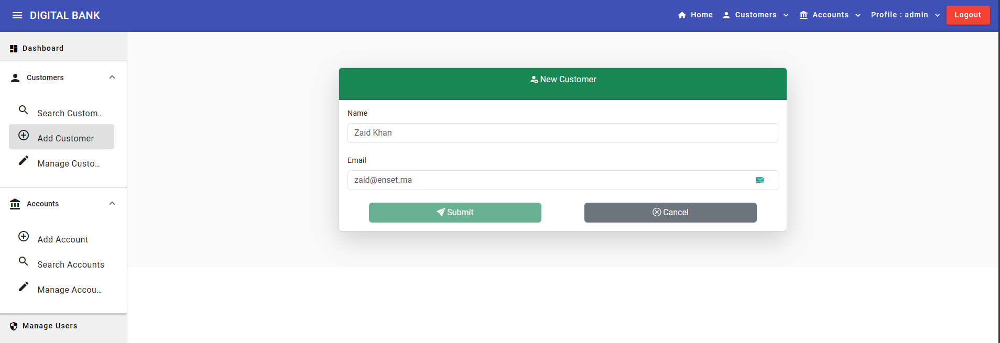
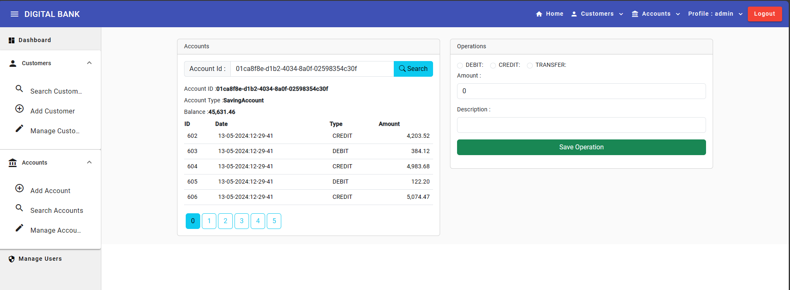

# Digital Banking

Une application de gestion des comptes bancaires permettant de gérer les clients, les comptes bancaires et les opérations de type débit ou crédit.

## Table des matières

1. [Présentation du projet](#présentation-du-projet)
2. [Technologies utilisées](#technologies-utilisées)
3. [Fonctionnalités](#fonctionnalités)
4. [Architecture du projet](#architecture-du-projet)
5. [Installation et configuration](#installation-et-configuration)
6. [Captures d'écran](#captures-décran)

## Présentation du projet

Digital Banking est une application conçue pour gérer des comptes bancaires. Chaque compte est associé à un client et peut subir plusieurs opérations de type débit ou crédit. Il existe deux types de comptes : comptes courants et comptes épargnes.

Le projet est divisé en deux parties principales : un backend basé sur Spring Boot et un frontend développé avec Angular.

### Backend

1. **Couche DAO :**
    - Création des entités JPA : Customer, BankAccount, SavingAccount, CurrentAccount, AccountOperation.
    - Définition des interfaces JPA Repository basées sur Spring Data.
    - Tests de la couche DAO.

2. **Couche service et Web :**
    - Mise en place de la couche service, des DTOs et des Mappers.
    - Création des RestController pour les services web RESTful.
    - Tests des services web RESTful.

3. **Swagger :**
    - Intégration de Swagger pour la documentation des API REST en utilisant la dépendance suivante :
      ```xml
      <dependency> 
        <groupId>org.springdoc</groupId> 
        <artifactId>springdoc-openapi-starter-webmvc-ui</artifactId> 
        <version>2.1.0</version> 
      </dependency>
      ```

4. **Sécurisation :**
    - Mise en place d'un système d'authentification basé sur Spring Security et JSON Web Token (JWT).

### Frontend

1. **Gestion des clients et des comptes :**
    - Développement des interfaces pour gérer les clients et les comptes bancaires.

2. **Dashboard et Statistiques :**
    - Utilisation de ChartJS (ng-chart) pour créer des graphiques et des statistiques dans la partie dashboard de l'application.

## Technologies utilisées

- **Backend :**
    - Spring Boot
    - Spring Data JPA
    - Spring Security
    - Springdoc OpenAPI (Swagger)
    - H2 Database (pour les tests)
    - MySQL
    - JSON Web Token (JWT)

- **Frontend :**
    - Angular
    - Bootstrap
    - ChartJS (ng-chart)

## Fonctionnalités

- Gestion des clients : ajout, suppression, édition, recherche.
- Gestion des comptes : ajout, recherche, administration.
- Enregistrement des opérations avec l'identifiant de l'utilisateur authentifié.
- Gestion des comptes et des mots de passe des utilisateurs.
- Dashboard avec des graphiques et des statistiques.

## Architecture du projet


## Installation et configuration

1. Cloner le dépôt :
   ```bash
   git clone https://github.com/Med124s/DigitalBanking_Spring_Angular.git
   ```

2. Configurer la base de données dans `application.properties` :
   ```properties
    spring.application.name=DigitalBanking_Spring_Angular
    server.port=8080
    
    #H2 Database Configuration
    #spring.datasource.url=jdbc:h2:mem:bank
    #spring.h2.console.enabled=true
    
    #MySQL Database Configuration
    spring.datasource.url=jdbc:mysql://localhost:3306/bank?createDatabaseIfNotExist=true
    spring.datasource.username=root
    spring.datasource.password=
    spring.jpa.hibernate.ddl-auto=update
    spring.jpa.properties.hibernate.dialect=org.hibernate.dialect.MariaDBDialect
    spring.jpa.show-sql=true
   ```

3. Lancer l'application Spring Boot :
   ```bash
   mvn spring-boot:run
   ```

4. Naviguer vers le dossier du frontend Angular et lancer le serveur de développement :
   ```bash
   cd frontend
   npm install
   ng serve
   ```

5. Accéder à l'application sur `http://localhost:4200`.

## Captures d'écran

### Page de connexion


### Page d'accueil utilisateur


### Tableau de bord


### Liste des clients


### Ajouter un client



### Modifier un client


### Supprimer un client


### Rechercher un compte



### Liste des comptes


### Modifier le profil


